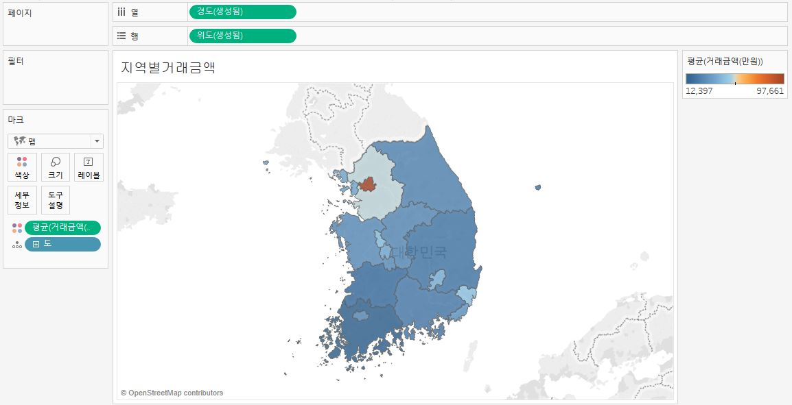
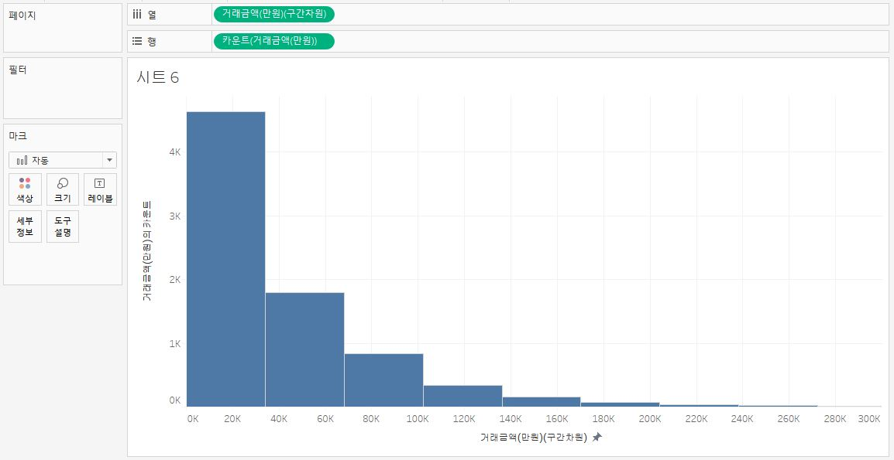
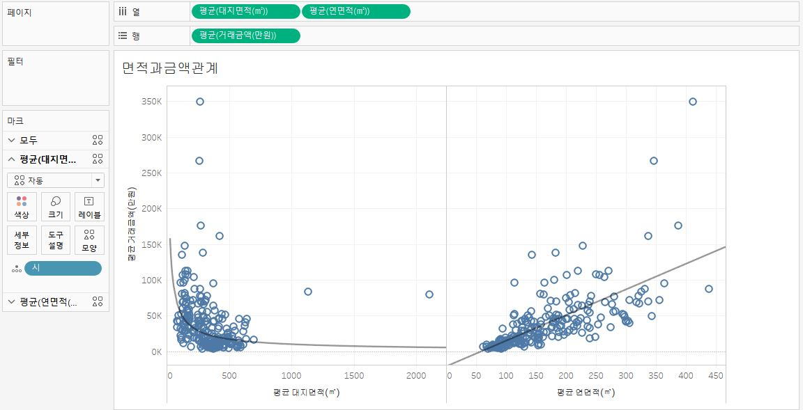
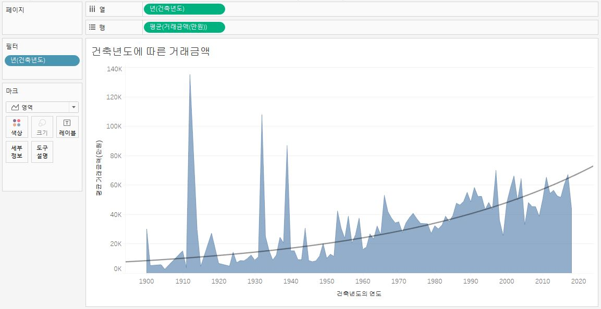
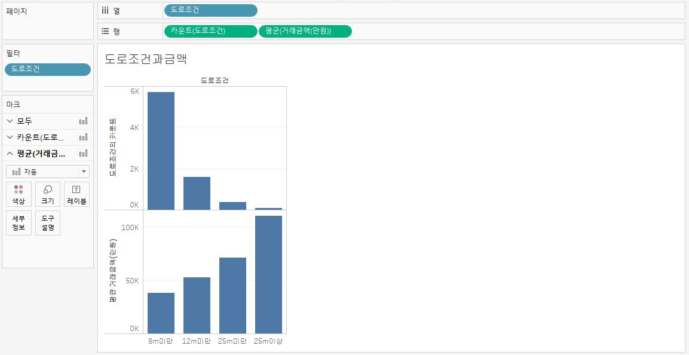
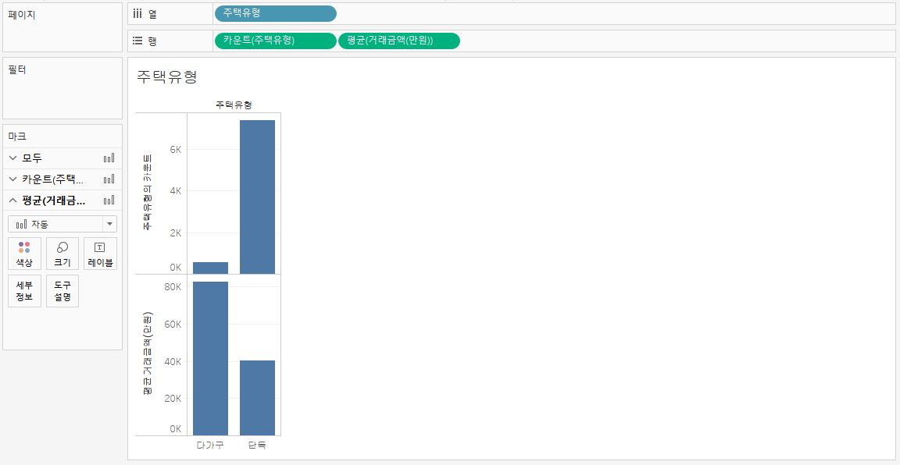
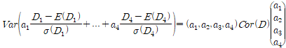
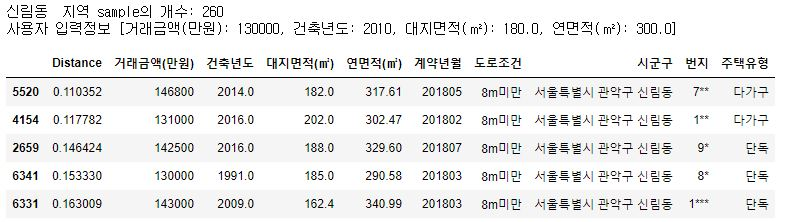

# 건축물 특성에 따른 유사군 추출 알고리즘 개발

> 2018.08.20~08.24 / 2018 국가 수리과학 연구소 산업수학 세미나
>
> data 공개 불가


## 목적

- 수학적 이론에 근거한 한국형 유사군 추출 알고리즘 개발
- 주택 및 토지 예측에 유의미한 새로운 변수와 아이디어 논의


## 개요

- 공공 데이터를 기반으로 본인이 원하는 주택/토지와 유사한 비교대상을 추출하는 수학적 방법론 논의
  - 단독 및 다가구 주택
  - 토지
- 데이터 탐색 및 시각화
  - 유의미한 데이터의 수학적 특징 파악
  - 주택 가격 결정하는데 필요한 새로운 변수 탐색


## 상세 내용

#### 1. excel 데이터 확인

- 소재지, 도로조건, 면적, 거래금액, 건축년도 등
- 총 10개 column


#### 2. 계산식

- 기본적으로 사용자가 원하는 조건에 가장 부합하는 (유클리디안 거리가 가장 가까운) 매물 출력

- 하지만, 각 데이터의 숫자 범위가 달라서 숫자가 큰 거래금액에 가중치가 가장 크게 적용되는 문제

- 정규화 할 경우 모든 컬럼간의 가중치가 동일하여 사용자가 어떤 요소에 우선순위를 두는지와 상관없는 결과가 나오게 된다.

- 해서 아래 3개의 식을 적용하여 서로 다른 결과를 도출하고, 가장 근접한 매물로 추천

  1. 로그로 구할때 함수

     ```python
     def g(i,x1,x2,x3,x4):
         return (((math.log(x1)-math.log(df[i,6])))**2+((math.log(x2)-math.log(df[i,7])))**2+((math.log(x3)-math.log(df[i,9])))**2+((x4-df[i,10])/dd1)**2)**0.5
     ```

  2. 정규화한 거리로 구하는 함수

     ```python
     def g(i,a1,a2,a3,a4,x1,x2,x3,x4):
         return (a1*((x1-df[i,6])/aa1)**2+a2*((x2-df[i,7])/bb1)**2+a3*((x3-df[i,9])/cc1)**2+a4*((x4-df[i,10])/dd1)**2)**0.5
     ```

  3. 절대값으로 구한 함수

     ```python
     def g(i,x1,x2,x3,x4):
         return abs((x1-df[i,6])/aa1)+abs((x2-df[i,7])/bb1)+abs((x3-df[i,9])/cc1)+abs((x4-df[i,10])/dd1)
     ```

     

#### 3. 시각화

- **tableau** 사용
- 각 요소별 거래 횟수, 거래 금액을 시각화














#### 4. 결과

- 지역적 조건을 선택한 후에는 연면적,대지면적,거래가격,건축년도 4가지로 유사성을 판단한다. 식은 아래와 같다 

      

- 각각의 데이터의 크기가 달라서 표준편차를 통해 정규화를 해준후 가중치를 부여했다.

  가중치를 계산 하는 방법은 아래와 같다.

      ,

- 사용자에 입력에 따른 상위 5개 매물 추천 결과이다. 첫번째 열의 distance가 작을수록 유사도가 높다고 판단한다.

  


## 결론 및 배운점

- 단순한 추천 알고리즘 모형을 구현해보면서, 유사도 판단의 기준과 가중치를 부여하는 법을 배웠다.
- 가장 간단한 방법으로 먼저 유클리디안 거리로 구해보고, 원하는 데이터와 달리 숫자의 규모가 큰 요소에 치중된다는 것을 확인했다. 이후 데이터를 정규화하여 모두 동일한 평균을 갖게 한 후, 가중치를 두는 것으로 조정했다.
- 처음에 과제를 받았을 당시에는 엑셀상에서 필터 기능을 써도 거의 동일한 결과가 나와서 굳이 모델을 만들어야 하는 의문이 있었다. 하지만, 필터링을 하면 각 요소에 +- 어느정도를 줄지를 사용자가 입력해야 하는 번거로움이 있기 때문에 좋은 프로그램이라고 할 수 없다고 생각했다.